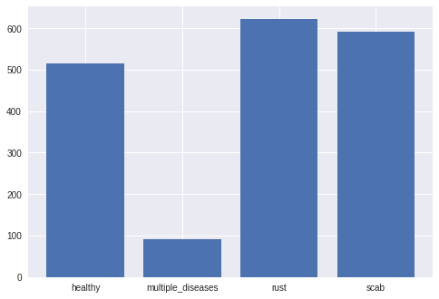
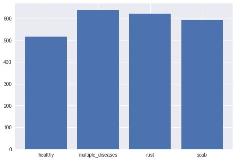
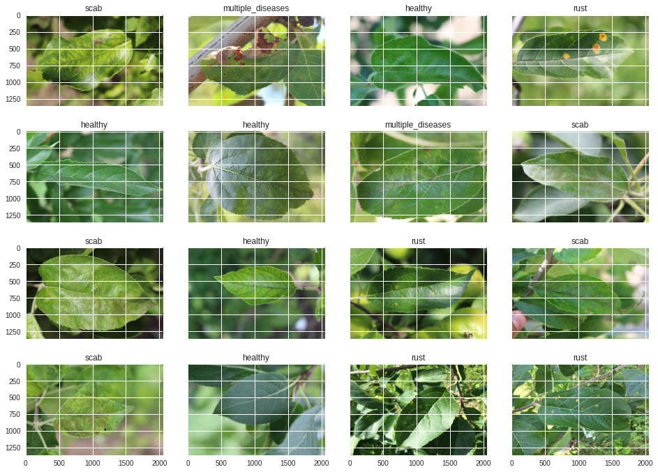
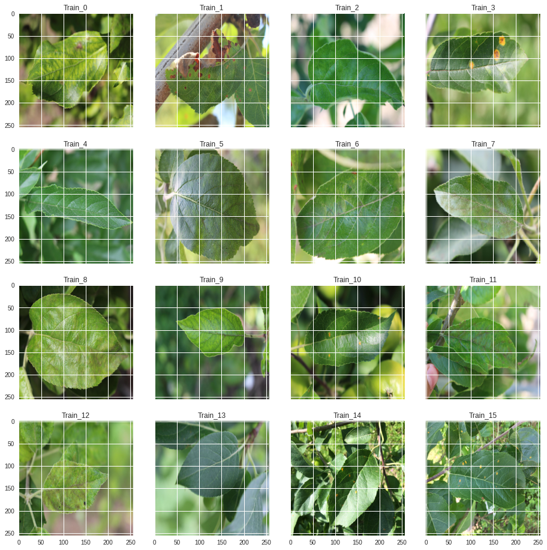
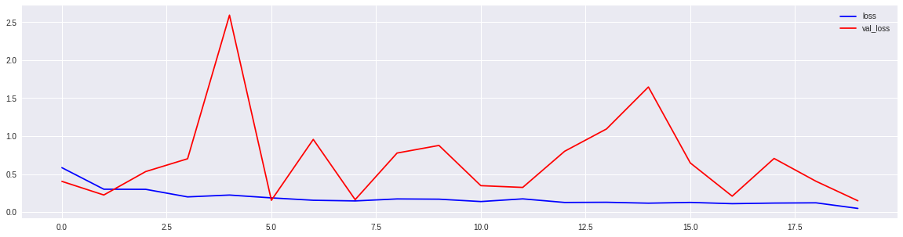
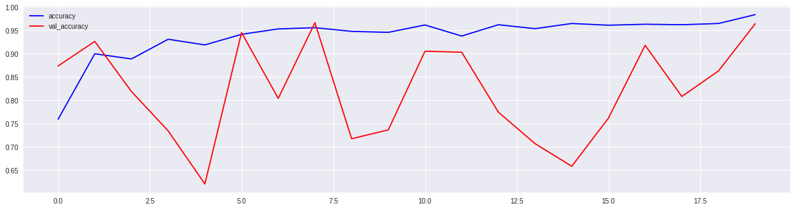

# 라이브러리 가져오기
인공 신경망 구축을 위한 텐서플로우, csv 파일 핸들링을 위한 판다스, 행렬 조작을 위한 넘파이를 가져온다


```python
import os
import ray
import random
import numpy as np
import pandas as pd
from PIL import Image
from tensorflow.keras import *
import matplotlib.pyplot as plt
from mpl_toolkits.axes_grid1 import ImageGrid
from keras_radam.training import RAdamOptimizer

```

# 분산처리 라이브러리 ray 초기화하기


```python
ray.init()
```

    2020-10-25 03:36:33,094	INFO services.py:1166 -- View the Ray dashboard at http://127.0.0.1:8265


    {'node_ip_address': '192.168.68.108',
     'raylet_ip_address': '192.168.68.108',
     'redis_address': '192.168.68.108:6379',
     'object_store_address': '/tmp/ray/session_2020-10-25_03-36-32_641639_273069/sockets/plasma_store',
     'raylet_socket_name': '/tmp/ray/session_2020-10-25_03-36-32_641639_273069/sockets/raylet',
     'webui_url': '127.0.0.1:8265',
     'session_dir': '/tmp/ray/session_2020-10-25_03-36-32_641639_273069',
     'metrics_export_port': 62534}


# GPU 사용 관련 설정


```python
import tensorflow as tf
 
gpus = tf.config.experimental.list_physical_devices('GPU')
if gpus:
  try:
    # Currently, memory growth needs to be the same across GPUs
    for gpu in gpus:
      tf.config.experimental.set_memory_growth(gpu, True)
    logical_gpus = tf.config.experimental.list_logical_devices('GPU')
    print(len(gpus), "Physical GPUs,", len(logical_gpus), "Logical GPUs")
  except RuntimeError as e:
    # Memory growth must be set before GPUs have been initialized
    print(e)

```

    1 Physical GPUs, 1 Logical GPUs


# 이미지 사이즈 설정하기
이미지를 가져온 다음, 신경망에 쉽게 적용하기 위해 리사이징이 필요하다. 리사이징을 어느 정도로 할지 정하는 파라미터이다


```python
IMAGE_SIZE=[256, 256] 
```

# 시각화 스타일 설정하기


```python
plt.style.use("seaborn")
```

# 데이터 로딩하기

## 경로 설정


```python
base_dir = "/home/bellmanlabs/HDD1/kaggle/plant-pathology-2020-fgvc7"
image_dir = os.path.join(base_dir, "images")
train_csv_path = os.path.join(base_dir, "train.csv")
test_csv_path = os.path.join(base_dir, "test.csv")
```

## 정답 레이블이 담긴 데이터프레임 가져오기


```python
train_df = pd.read_csv(train_csv_path)
test_df = pd.read_csv(test_csv_path)
```

## 데이터프레임 확인하기
image_id: 각 이미지의 고유 id. 레이블과 이미지를 매칭하는 데 쓴다  
healthy: 식물이 건강한 경우.  
multiple_diseases: 식물이 복합적인 병을 가진 경우.  
rust: 식물이 녹병균에 걸린 경우.  
scab: 식물 잎에 딱지가 많이 앉은 경우


```python
train_df.head()
```


<div>
<style scoped>
    .dataframe tbody tr th:only-of-type {
        vertical-align: middle;
    }

    .dataframe tbody tr th {
        vertical-align: top;
    }

    .dataframe thead th {
        text-align: right;
    }
</style>
<table border="1" class="dataframe">
  <thead>
    <tr style="text-align: right;">
      <th></th>
      <th>image_id</th>
      <th>healthy</th>
      <th>multiple_diseases</th>
      <th>rust</th>
      <th>scab</th>
    </tr>
  </thead>
  <tbody>
    <tr>
      <th>0</th>
      <td>Train_0</td>
      <td>0</td>
      <td>0</td>
      <td>0</td>
      <td>1</td>
    </tr>
    <tr>
      <th>1</th>
      <td>Train_1</td>
      <td>0</td>
      <td>1</td>
      <td>0</td>
      <td>0</td>
    </tr>
    <tr>
      <th>2</th>
      <td>Train_2</td>
      <td>1</td>
      <td>0</td>
      <td>0</td>
      <td>0</td>
    </tr>
    <tr>
      <th>3</th>
      <td>Train_3</td>
      <td>0</td>
      <td>0</td>
      <td>1</td>
      <td>0</td>
    </tr>
    <tr>
      <th>4</th>
      <td>Train_4</td>
      <td>1</td>
      <td>0</td>
      <td>0</td>
      <td>0</td>
    </tr>
  </tbody>
</table>
</div>


## 데이터셋 분포 확인하기
다른 레이블에 비해 multiple_diseases(복합적인 병에 걸린 경우) 가 적은 것을 볼 수 있다.


```python
plt.bar(train_df.columns[1:], [train_df[x].sum() for x in train_df.columns[1:]])
```


    <BarContainer object of 4 artists>


    

    


## 데이터 imbalance 수정하기
데이터의 한 레이블이 과도하게 작으면 학습이 안정적으로 되지 않을 수 있다.  
따라서 imbalance한 데이터를 다루기 위한 방법 중 가장 간단한 방법을 적용한다.  
바로 부족한 레이블의 갯수를 다른 레이블과 비슷한 수준으로 맞춰주는 것이다.


```python
n = np.mean([[len(list(train_df[train_df[x] == 1].index)) for x in ["healthy", "rust", "scab"]]]) // len(list(train_df[train_df["multiple_diseases"] == 1].index))
appender = pd.DataFrame(train_df[train_df["multiple_diseases"] == 1])
for _ in range(int(n)):
    train_df = train_df.append(appender)
```


```python
train_ids = train_df["image_id"].to_list()
```


```python
plt.bar(train_df.columns[1:], [train_df[x].sum() for x in train_df.columns[1:]])
train_df = train_df.drop_duplicates()
```


    

    


# 이미지 시각화하기


```python
fig = plt.figure(figsize=(16., 16.))
grid = ImageGrid(fig, 111,  # similar to subplot(111)
                 nrows_ncols=(4, 4),  # creates 2x2 grid of axes
                 axes_pad=0.5,  # pad between axes in inch.
                 )

for ax, image_id in zip(grid, [x for x in train_df["image_id"][:4*4]]):
    # Iterating over the grid returns the Axes.
    im = Image.open(os.path.join(image_dir, image_id + ".jpg"))
    title = train_df.columns[1:][train_df.loc[train_df["image_id"] == image_id][train_df.columns[1:]].values.argmax()]
    ax.set_title(title)
    ax.imshow(im)

plt.show()
```


    

    


# 이미지 전처리하기
이미지를 로딩하고 사이즈를 바꾼 다음 이미지 행렬을 0~1사이의 값으로 바꿔준다


```python
@ray.remote
def load_preprocess_image(image_id, resize_to=IMAGE_SIZE):
    path = os.path.join(image_dir, image_id + ".jpg")
    image_arr = np.array(Image.open(path).resize(resize_to)) / 255
    return image_arr

def load_label(image_id):
    return train_df.loc[train_df["image_id"] == image_id][train_df.columns[1:]].values.squeeze()
```


```python
fig = plt.figure(figsize=(16., 16.))
grid = ImageGrid(fig, 111,  # similar to subplot(111)
                 nrows_ncols=(4, 4),  # creates 2x2 grid of axes
                 axes_pad=0.5,  # pad between axes in inch.
                 )

for ax, image_id in zip(grid, [x for x in train_df["image_id"][:4*4]]):
    # Iterating over the grid returns the Axes.
    im = ray.get(load_preprocess_image.remote(image_id))
    ax.set_title(image_id)
    ax.imshow(im)

plt.show()
```


    

    


# 데이터 로딩하기


```python
image_ids = np.array(train_ids)
np.random.shuffle(image_ids)

train_image_ids = image_ids[:int(len(image_ids)*0.8)]
validation_image_ids = image_ids[int(len(image_ids)*0.8):]
```


```python
train_x = [load_preprocess_image.remote(image_id) for image_id in train_image_ids]
train_x = np.array([ray.get(x) for x in train_x])
train_y = np.array([load_label(image_id) for image_id in train_image_ids])

val_x = [load_preprocess_image.remote(image_id) for image_id in validation_image_ids]
val_x = np.array([ray.get(x) for x in val_x])
val_y = np.array([load_label(image_id) for image_id in validation_image_ids])
```

# 모델 만들기
합성곱 신경망(Convolutional Neural Networks)를 기반으로 한 DenseNet모델을 사용한다.  
<a href="https://arxiv.org/abs/1608.06993">Densely Connected Convolutional Networks(Heung et al, 2016)


```python
# load pre-trained DenseNet
base_model = applications.DenseNet121(include_top=False, input_shape=IMAGE_SIZE + [3]) 

# add fully-connected layers
x = base_model.output
x = layers.GlobalAveragePooling2D()(x)
x = layers.Dense(1024, activation="relu")(x)
x = layers.Dense(4, activation="softmax")(x)

# package model
model = models.Model(inputs=base_model.input, outputs=x)

# complie model
model.compile(loss="categorical_crossentropy", optimizer=RAdamOptimizer(min_lr=1e-7), metrics=["accuracy"])
```

# 모델 구조


```python
model.summary()
```

    Model: "model"
    __________________________________________________________________________________________________
    Layer (type)                    Output Shape         Param #     Connected to                     
    ==================================================================================================
    input_1 (InputLayer)            [(None, 256, 256, 3) 0                                            
    __________________________________________________________________________________________________
    zero_padding2d (ZeroPadding2D)  (None, 262, 262, 3)  0           input_1[0][0]                    
    __________________________________________________________________________________________________
    conv1/conv (Conv2D)             (None, 128, 128, 64) 9408        zero_padding2d[0][0]             
    __________________________________________________________________________________________________
    conv1/bn (BatchNormalization)   (None, 128, 128, 64) 256         conv1/conv[0][0]                 
    __________________________________________________________________________________________________
    conv1/relu (Activation)         (None, 128, 128, 64) 0           conv1/bn[0][0]                   
    __________________________________________________________________________________________________
    zero_padding2d_1 (ZeroPadding2D (None, 130, 130, 64) 0           conv1/relu[0][0]                 
    __________________________________________________________________________________________________
    pool1 (MaxPooling2D)            (None, 64, 64, 64)   0           zero_padding2d_1[0][0]           
    __________________________________________________________________________________________________
    conv2_block1_0_bn (BatchNormali (None, 64, 64, 64)   256         pool1[0][0]                      
    __________________________________________________________________________________________________
    conv2_block1_0_relu (Activation (None, 64, 64, 64)   0           conv2_block1_0_bn[0][0]          
    __________________________________________________________________________________________________
    conv2_block1_1_conv (Conv2D)    (None, 64, 64, 128)  8192        conv2_block1_0_relu[0][0]        
    __________________________________________________________________________________________________
    conv2_block1_1_bn (BatchNormali (None, 64, 64, 128)  512         conv2_block1_1_conv[0][0]        
    __________________________________________________________________________________________________
    conv2_block1_1_relu (Activation (None, 64, 64, 128)  0           conv2_block1_1_bn[0][0]          
    __________________________________________________________________________________________________
    conv2_block1_2_conv (Conv2D)    (None, 64, 64, 32)   36864       conv2_block1_1_relu[0][0]        
    __________________________________________________________________________________________________
    conv2_block1_concat (Concatenat (None, 64, 64, 96)   0           pool1[0][0]                      
                                                                     conv2_block1_2_conv[0][0]        
    __________________________________________________________________________________________________
    conv2_block2_0_bn (BatchNormali (None, 64, 64, 96)   384         conv2_block1_concat[0][0]        
    __________________________________________________________________________________________________
    conv2_block2_0_relu (Activation (None, 64, 64, 96)   0           conv2_block2_0_bn[0][0]          
    __________________________________________________________________________________________________
    conv2_block2_1_conv (Conv2D)    (None, 64, 64, 128)  12288       conv2_block2_0_relu[0][0]        
    __________________________________________________________________________________________________
    conv2_block2_1_bn (BatchNormali (None, 64, 64, 128)  512         conv2_block2_1_conv[0][0]        
    __________________________________________________________________________________________________
    conv2_block2_1_relu (Activation (None, 64, 64, 128)  0           conv2_block2_1_bn[0][0]          
    __________________________________________________________________________________________________
    conv2_block2_2_conv (Conv2D)    (None, 64, 64, 32)   36864       conv2_block2_1_relu[0][0]        
    __________________________________________________________________________________________________
    conv2_block2_concat (Concatenat (None, 64, 64, 128)  0           conv2_block1_concat[0][0]        
                                                                     conv2_block2_2_conv[0][0]        
    __________________________________________________________________________________________________
    conv2_block3_0_bn (BatchNormali (None, 64, 64, 128)  512         conv2_block2_concat[0][0]        
    __________________________________________________________________________________________________
    conv2_block3_0_relu (Activation (None, 64, 64, 128)  0           conv2_block3_0_bn[0][0]          
    __________________________________________________________________________________________________
    conv2_block3_1_conv (Conv2D)    (None, 64, 64, 128)  16384       conv2_block3_0_relu[0][0]        
    __________________________________________________________________________________________________
    conv2_block3_1_bn (BatchNormali (None, 64, 64, 128)  512         conv2_block3_1_conv[0][0]        
    __________________________________________________________________________________________________
    conv2_block3_1_relu (Activation (None, 64, 64, 128)  0           conv2_block3_1_bn[0][0]          
    __________________________________________________________________________________________________
    conv2_block3_2_conv (Conv2D)    (None, 64, 64, 32)   36864       conv2_block3_1_relu[0][0]        
    __________________________________________________________________________________________________
    conv2_block3_concat (Concatenat (None, 64, 64, 160)  0           conv2_block2_concat[0][0]        
                                                                     conv2_block3_2_conv[0][0]        
    __________________________________________________________________________________________________
    conv2_block4_0_bn (BatchNormali (None, 64, 64, 160)  640         conv2_block3_concat[0][0]        
    __________________________________________________________________________________________________
    conv2_block4_0_relu (Activation (None, 64, 64, 160)  0           conv2_block4_0_bn[0][0]          
    __________________________________________________________________________________________________
    conv2_block4_1_conv (Conv2D)    (None, 64, 64, 128)  20480       conv2_block4_0_relu[0][0]        
    __________________________________________________________________________________________________
    conv2_block4_1_bn (BatchNormali (None, 64, 64, 128)  512         conv2_block4_1_conv[0][0]        
    __________________________________________________________________________________________________
    conv2_block4_1_relu (Activation (None, 64, 64, 128)  0           conv2_block4_1_bn[0][0]          
    __________________________________________________________________________________________________
    conv2_block4_2_conv (Conv2D)    (None, 64, 64, 32)   36864       conv2_block4_1_relu[0][0]        
    __________________________________________________________________________________________________
    conv2_block4_concat (Concatenat (None, 64, 64, 192)  0           conv2_block3_concat[0][0]        
                                                                     conv2_block4_2_conv[0][0]        
    __________________________________________________________________________________________________
    conv2_block5_0_bn (BatchNormali (None, 64, 64, 192)  768         conv2_block4_concat[0][0]        
    __________________________________________________________________________________________________
    conv2_block5_0_relu (Activation (None, 64, 64, 192)  0           conv2_block5_0_bn[0][0]          
    __________________________________________________________________________________________________
    conv2_block5_1_conv (Conv2D)    (None, 64, 64, 128)  24576       conv2_block5_0_relu[0][0]        
    __________________________________________________________________________________________________
    conv2_block5_1_bn (BatchNormali (None, 64, 64, 128)  512         conv2_block5_1_conv[0][0]        
    __________________________________________________________________________________________________
    conv2_block5_1_relu (Activation (None, 64, 64, 128)  0           conv2_block5_1_bn[0][0]          
    __________________________________________________________________________________________________
    conv2_block5_2_conv (Conv2D)    (None, 64, 64, 32)   36864       conv2_block5_1_relu[0][0]        
    __________________________________________________________________________________________________
    conv2_block5_concat (Concatenat (None, 64, 64, 224)  0           conv2_block4_concat[0][0]        
                                                                     conv2_block5_2_conv[0][0]        
    __________________________________________________________________________________________________
    conv2_block6_0_bn (BatchNormali (None, 64, 64, 224)  896         conv2_block5_concat[0][0]        
    __________________________________________________________________________________________________
    conv2_block6_0_relu (Activation (None, 64, 64, 224)  0           conv2_block6_0_bn[0][0]          
    __________________________________________________________________________________________________
    conv2_block6_1_conv (Conv2D)    (None, 64, 64, 128)  28672       conv2_block6_0_relu[0][0]        
    __________________________________________________________________________________________________
    conv2_block6_1_bn (BatchNormali (None, 64, 64, 128)  512         conv2_block6_1_conv[0][0]        
    __________________________________________________________________________________________________
    conv2_block6_1_relu (Activation (None, 64, 64, 128)  0           conv2_block6_1_bn[0][0]          
    __________________________________________________________________________________________________
    conv2_block6_2_conv (Conv2D)    (None, 64, 64, 32)   36864       conv2_block6_1_relu[0][0]        
    __________________________________________________________________________________________________
    conv2_block6_concat (Concatenat (None, 64, 64, 256)  0           conv2_block5_concat[0][0]        
                                                                     conv2_block6_2_conv[0][0]        
    __________________________________________________________________________________________________
    pool2_bn (BatchNormalization)   (None, 64, 64, 256)  1024        conv2_block6_concat[0][0]        
    __________________________________________________________________________________________________
    pool2_relu (Activation)         (None, 64, 64, 256)  0           pool2_bn[0][0]                   
    __________________________________________________________________________________________________
    pool2_conv (Conv2D)             (None, 64, 64, 128)  32768       pool2_relu[0][0]                 
    __________________________________________________________________________________________________
    pool2_pool (AveragePooling2D)   (None, 32, 32, 128)  0           pool2_conv[0][0]                 
    __________________________________________________________________________________________________
    conv3_block1_0_bn (BatchNormali (None, 32, 32, 128)  512         pool2_pool[0][0]                 
    __________________________________________________________________________________________________
    conv3_block1_0_relu (Activation (None, 32, 32, 128)  0           conv3_block1_0_bn[0][0]          
    __________________________________________________________________________________________________
    conv3_block1_1_conv (Conv2D)    (None, 32, 32, 128)  16384       conv3_block1_0_relu[0][0]        
    __________________________________________________________________________________________________
    conv3_block1_1_bn (BatchNormali (None, 32, 32, 128)  512         conv3_block1_1_conv[0][0]        
    __________________________________________________________________________________________________
    conv3_block1_1_relu (Activation (None, 32, 32, 128)  0           conv3_block1_1_bn[0][0]          
    __________________________________________________________________________________________________
    conv3_block1_2_conv (Conv2D)    (None, 32, 32, 32)   36864       conv3_block1_1_relu[0][0]        
    __________________________________________________________________________________________________
    conv3_block1_concat (Concatenat (None, 32, 32, 160)  0           pool2_pool[0][0]                 
                                                                     conv3_block1_2_conv[0][0]        
    __________________________________________________________________________________________________
    conv3_block2_0_bn (BatchNormali (None, 32, 32, 160)  640         conv3_block1_concat[0][0]        
    __________________________________________________________________________________________________
    conv3_block2_0_relu (Activation (None, 32, 32, 160)  0           conv3_block2_0_bn[0][0]          
    __________________________________________________________________________________________________
    conv3_block2_1_conv (Conv2D)    (None, 32, 32, 128)  20480       conv3_block2_0_relu[0][0]        
    __________________________________________________________________________________________________
    conv3_block2_1_bn (BatchNormali (None, 32, 32, 128)  512         conv3_block2_1_conv[0][0]        
    __________________________________________________________________________________________________
    conv3_block2_1_relu (Activation (None, 32, 32, 128)  0           conv3_block2_1_bn[0][0]          
    __________________________________________________________________________________________________
    conv3_block2_2_conv (Conv2D)    (None, 32, 32, 32)   36864       conv3_block2_1_relu[0][0]        
    __________________________________________________________________________________________________
    conv3_block2_concat (Concatenat (None, 32, 32, 192)  0           conv3_block1_concat[0][0]        
                                                                     conv3_block2_2_conv[0][0]        
    __________________________________________________________________________________________________
    conv3_block3_0_bn (BatchNormali (None, 32, 32, 192)  768         conv3_block2_concat[0][0]        
    __________________________________________________________________________________________________
    conv3_block3_0_relu (Activation (None, 32, 32, 192)  0           conv3_block3_0_bn[0][0]          
    __________________________________________________________________________________________________
    conv3_block3_1_conv (Conv2D)    (None, 32, 32, 128)  24576       conv3_block3_0_relu[0][0]        
    __________________________________________________________________________________________________
    conv3_block3_1_bn (BatchNormali (None, 32, 32, 128)  512         conv3_block3_1_conv[0][0]        
    __________________________________________________________________________________________________
    conv3_block3_1_relu (Activation (None, 32, 32, 128)  0           conv3_block3_1_bn[0][0]          
    __________________________________________________________________________________________________
    conv3_block3_2_conv (Conv2D)    (None, 32, 32, 32)   36864       conv3_block3_1_relu[0][0]        
    __________________________________________________________________________________________________
    conv3_block3_concat (Concatenat (None, 32, 32, 224)  0           conv3_block2_concat[0][0]        
                                                                     conv3_block3_2_conv[0][0]        
    __________________________________________________________________________________________________
    conv3_block4_0_bn (BatchNormali (None, 32, 32, 224)  896         conv3_block3_concat[0][0]        
    __________________________________________________________________________________________________
    conv3_block4_0_relu (Activation (None, 32, 32, 224)  0           conv3_block4_0_bn[0][0]          
    __________________________________________________________________________________________________
    conv3_block4_1_conv (Conv2D)    (None, 32, 32, 128)  28672       conv3_block4_0_relu[0][0]        
    __________________________________________________________________________________________________
    conv3_block4_1_bn (BatchNormali (None, 32, 32, 128)  512         conv3_block4_1_conv[0][0]        
    __________________________________________________________________________________________________
    conv3_block4_1_relu (Activation (None, 32, 32, 128)  0           conv3_block4_1_bn[0][0]          
    __________________________________________________________________________________________________
    conv3_block4_2_conv (Conv2D)    (None, 32, 32, 32)   36864       conv3_block4_1_relu[0][0]        
    __________________________________________________________________________________________________
    conv3_block4_concat (Concatenat (None, 32, 32, 256)  0           conv3_block3_concat[0][0]        
                                                                     conv3_block4_2_conv[0][0]        
    __________________________________________________________________________________________________
    conv3_block5_0_bn (BatchNormali (None, 32, 32, 256)  1024        conv3_block4_concat[0][0]        
    __________________________________________________________________________________________________
    conv3_block5_0_relu (Activation (None, 32, 32, 256)  0           conv3_block5_0_bn[0][0]          
    __________________________________________________________________________________________________
    conv3_block5_1_conv (Conv2D)    (None, 32, 32, 128)  32768       conv3_block5_0_relu[0][0]        
    __________________________________________________________________________________________________
    conv3_block5_1_bn (BatchNormali (None, 32, 32, 128)  512         conv3_block5_1_conv[0][0]        
    __________________________________________________________________________________________________
    conv3_block5_1_relu (Activation (None, 32, 32, 128)  0           conv3_block5_1_bn[0][0]          
    __________________________________________________________________________________________________
    conv3_block5_2_conv (Conv2D)    (None, 32, 32, 32)   36864       conv3_block5_1_relu[0][0]        
    __________________________________________________________________________________________________
    conv3_block5_concat (Concatenat (None, 32, 32, 288)  0           conv3_block4_concat[0][0]        
                                                                     conv3_block5_2_conv[0][0]        
    __________________________________________________________________________________________________
    conv3_block6_0_bn (BatchNormali (None, 32, 32, 288)  1152        conv3_block5_concat[0][0]        
    __________________________________________________________________________________________________
    conv3_block6_0_relu (Activation (None, 32, 32, 288)  0           conv3_block6_0_bn[0][0]          
    __________________________________________________________________________________________________
    conv3_block6_1_conv (Conv2D)    (None, 32, 32, 128)  36864       conv3_block6_0_relu[0][0]        
    __________________________________________________________________________________________________
    conv3_block6_1_bn (BatchNormali (None, 32, 32, 128)  512         conv3_block6_1_conv[0][0]        
    __________________________________________________________________________________________________
    conv3_block6_1_relu (Activation (None, 32, 32, 128)  0           conv3_block6_1_bn[0][0]          
    __________________________________________________________________________________________________
    conv3_block6_2_conv (Conv2D)    (None, 32, 32, 32)   36864       conv3_block6_1_relu[0][0]        
    __________________________________________________________________________________________________
    conv3_block6_concat (Concatenat (None, 32, 32, 320)  0           conv3_block5_concat[0][0]        
                                                                     conv3_block6_2_conv[0][0]        
    __________________________________________________________________________________________________
    conv3_block7_0_bn (BatchNormali (None, 32, 32, 320)  1280        conv3_block6_concat[0][0]        
    __________________________________________________________________________________________________
    conv3_block7_0_relu (Activation (None, 32, 32, 320)  0           conv3_block7_0_bn[0][0]          
    __________________________________________________________________________________________________
    conv3_block7_1_conv (Conv2D)    (None, 32, 32, 128)  40960       conv3_block7_0_relu[0][0]        
    __________________________________________________________________________________________________
    conv3_block7_1_bn (BatchNormali (None, 32, 32, 128)  512         conv3_block7_1_conv[0][0]        
    __________________________________________________________________________________________________
    conv3_block7_1_relu (Activation (None, 32, 32, 128)  0           conv3_block7_1_bn[0][0]          
    __________________________________________________________________________________________________
    conv3_block7_2_conv (Conv2D)    (None, 32, 32, 32)   36864       conv3_block7_1_relu[0][0]        
    __________________________________________________________________________________________________
    conv3_block7_concat (Concatenat (None, 32, 32, 352)  0           conv3_block6_concat[0][0]        
                                                                     conv3_block7_2_conv[0][0]        
    __________________________________________________________________________________________________
    conv3_block8_0_bn (BatchNormali (None, 32, 32, 352)  1408        conv3_block7_concat[0][0]        
    __________________________________________________________________________________________________
    conv3_block8_0_relu (Activation (None, 32, 32, 352)  0           conv3_block8_0_bn[0][0]          
    __________________________________________________________________________________________________
    conv3_block8_1_conv (Conv2D)    (None, 32, 32, 128)  45056       conv3_block8_0_relu[0][0]        
    __________________________________________________________________________________________________
    conv3_block8_1_bn (BatchNormali (None, 32, 32, 128)  512         conv3_block8_1_conv[0][0]        
    __________________________________________________________________________________________________
    conv3_block8_1_relu (Activation (None, 32, 32, 128)  0           conv3_block8_1_bn[0][0]          
    __________________________________________________________________________________________________
    conv3_block8_2_conv (Conv2D)    (None, 32, 32, 32)   36864       conv3_block8_1_relu[0][0]        
    __________________________________________________________________________________________________
    conv3_block8_concat (Concatenat (None, 32, 32, 384)  0           conv3_block7_concat[0][0]        
                                                                     conv3_block8_2_conv[0][0]        
    __________________________________________________________________________________________________
    conv3_block9_0_bn (BatchNormali (None, 32, 32, 384)  1536        conv3_block8_concat[0][0]        
    __________________________________________________________________________________________________
    conv3_block9_0_relu (Activation (None, 32, 32, 384)  0           conv3_block9_0_bn[0][0]          
    __________________________________________________________________________________________________
    conv3_block9_1_conv (Conv2D)    (None, 32, 32, 128)  49152       conv3_block9_0_relu[0][0]        
    __________________________________________________________________________________________________
    conv3_block9_1_bn (BatchNormali (None, 32, 32, 128)  512         conv3_block9_1_conv[0][0]        
    __________________________________________________________________________________________________
    conv3_block9_1_relu (Activation (None, 32, 32, 128)  0           conv3_block9_1_bn[0][0]          
    __________________________________________________________________________________________________
    conv3_block9_2_conv (Conv2D)    (None, 32, 32, 32)   36864       conv3_block9_1_relu[0][0]        
    __________________________________________________________________________________________________
    conv3_block9_concat (Concatenat (None, 32, 32, 416)  0           conv3_block8_concat[0][0]        
                                                                     conv3_block9_2_conv[0][0]        
    __________________________________________________________________________________________________
    conv3_block10_0_bn (BatchNormal (None, 32, 32, 416)  1664        conv3_block9_concat[0][0]        
    __________________________________________________________________________________________________
    conv3_block10_0_relu (Activatio (None, 32, 32, 416)  0           conv3_block10_0_bn[0][0]         
    __________________________________________________________________________________________________
    conv3_block10_1_conv (Conv2D)   (None, 32, 32, 128)  53248       conv3_block10_0_relu[0][0]       
    __________________________________________________________________________________________________
    conv3_block10_1_bn (BatchNormal (None, 32, 32, 128)  512         conv3_block10_1_conv[0][0]       
    __________________________________________________________________________________________________
    conv3_block10_1_relu (Activatio (None, 32, 32, 128)  0           conv3_block10_1_bn[0][0]         
    __________________________________________________________________________________________________
    conv3_block10_2_conv (Conv2D)   (None, 32, 32, 32)   36864       conv3_block10_1_relu[0][0]       
    __________________________________________________________________________________________________
    conv3_block10_concat (Concatena (None, 32, 32, 448)  0           conv3_block9_concat[0][0]        
                                                                     conv3_block10_2_conv[0][0]       
    __________________________________________________________________________________________________
    conv3_block11_0_bn (BatchNormal (None, 32, 32, 448)  1792        conv3_block10_concat[0][0]       
    __________________________________________________________________________________________________
    conv3_block11_0_relu (Activatio (None, 32, 32, 448)  0           conv3_block11_0_bn[0][0]         
    __________________________________________________________________________________________________
    conv3_block11_1_conv (Conv2D)   (None, 32, 32, 128)  57344       conv3_block11_0_relu[0][0]       
    __________________________________________________________________________________________________
    conv3_block11_1_bn (BatchNormal (None, 32, 32, 128)  512         conv3_block11_1_conv[0][0]       
    __________________________________________________________________________________________________
    conv3_block11_1_relu (Activatio (None, 32, 32, 128)  0           conv3_block11_1_bn[0][0]         
    __________________________________________________________________________________________________
    conv3_block11_2_conv (Conv2D)   (None, 32, 32, 32)   36864       conv3_block11_1_relu[0][0]       
    __________________________________________________________________________________________________
    conv3_block11_concat (Concatena (None, 32, 32, 480)  0           conv3_block10_concat[0][0]       
                                                                     conv3_block11_2_conv[0][0]       
    __________________________________________________________________________________________________
    conv3_block12_0_bn (BatchNormal (None, 32, 32, 480)  1920        conv3_block11_concat[0][0]       
    __________________________________________________________________________________________________
    conv3_block12_0_relu (Activatio (None, 32, 32, 480)  0           conv3_block12_0_bn[0][0]         
    __________________________________________________________________________________________________
    conv3_block12_1_conv (Conv2D)   (None, 32, 32, 128)  61440       conv3_block12_0_relu[0][0]       
    __________________________________________________________________________________________________
    conv3_block12_1_bn (BatchNormal (None, 32, 32, 128)  512         conv3_block12_1_conv[0][0]       
    __________________________________________________________________________________________________
    conv3_block12_1_relu (Activatio (None, 32, 32, 128)  0           conv3_block12_1_bn[0][0]         
    __________________________________________________________________________________________________
    conv3_block12_2_conv (Conv2D)   (None, 32, 32, 32)   36864       conv3_block12_1_relu[0][0]       
    __________________________________________________________________________________________________
    conv3_block12_concat (Concatena (None, 32, 32, 512)  0           conv3_block11_concat[0][0]       
                                                                     conv3_block12_2_conv[0][0]       
    __________________________________________________________________________________________________
    pool3_bn (BatchNormalization)   (None, 32, 32, 512)  2048        conv3_block12_concat[0][0]       
    __________________________________________________________________________________________________
    pool3_relu (Activation)         (None, 32, 32, 512)  0           pool3_bn[0][0]                   
    __________________________________________________________________________________________________
    pool3_conv (Conv2D)             (None, 32, 32, 256)  131072      pool3_relu[0][0]                 
    __________________________________________________________________________________________________
    pool3_pool (AveragePooling2D)   (None, 16, 16, 256)  0           pool3_conv[0][0]                 
    __________________________________________________________________________________________________
    conv4_block1_0_bn (BatchNormali (None, 16, 16, 256)  1024        pool3_pool[0][0]                 
    __________________________________________________________________________________________________
    conv4_block1_0_relu (Activation (None, 16, 16, 256)  0           conv4_block1_0_bn[0][0]          
    __________________________________________________________________________________________________
    conv4_block1_1_conv (Conv2D)    (None, 16, 16, 128)  32768       conv4_block1_0_relu[0][0]        
    __________________________________________________________________________________________________
    conv4_block1_1_bn (BatchNormali (None, 16, 16, 128)  512         conv4_block1_1_conv[0][0]        
    __________________________________________________________________________________________________
    conv4_block1_1_relu (Activation (None, 16, 16, 128)  0           conv4_block1_1_bn[0][0]          
    __________________________________________________________________________________________________
    conv4_block1_2_conv (Conv2D)    (None, 16, 16, 32)   36864       conv4_block1_1_relu[0][0]        
    __________________________________________________________________________________________________
    conv4_block1_concat (Concatenat (None, 16, 16, 288)  0           pool3_pool[0][0]                 
                                                                     conv4_block1_2_conv[0][0]        
    __________________________________________________________________________________________________
    conv4_block2_0_bn (BatchNormali (None, 16, 16, 288)  1152        conv4_block1_concat[0][0]        
    __________________________________________________________________________________________________
    conv4_block2_0_relu (Activation (None, 16, 16, 288)  0           conv4_block2_0_bn[0][0]          
    __________________________________________________________________________________________________
    conv4_block2_1_conv (Conv2D)    (None, 16, 16, 128)  36864       conv4_block2_0_relu[0][0]        
    __________________________________________________________________________________________________
    conv4_block2_1_bn (BatchNormali (None, 16, 16, 128)  512         conv4_block2_1_conv[0][0]        
    __________________________________________________________________________________________________
    conv4_block2_1_relu (Activation (None, 16, 16, 128)  0           conv4_block2_1_bn[0][0]          
    __________________________________________________________________________________________________
    conv4_block2_2_conv (Conv2D)    (None, 16, 16, 32)   36864       conv4_block2_1_relu[0][0]        
    __________________________________________________________________________________________________
    conv4_block2_concat (Concatenat (None, 16, 16, 320)  0           conv4_block1_concat[0][0]        
                                                                     conv4_block2_2_conv[0][0]        
    __________________________________________________________________________________________________
    conv4_block3_0_bn (BatchNormali (None, 16, 16, 320)  1280        conv4_block2_concat[0][0]        
    __________________________________________________________________________________________________
    conv4_block3_0_relu (Activation (None, 16, 16, 320)  0           conv4_block3_0_bn[0][0]          
    __________________________________________________________________________________________________
    conv4_block3_1_conv (Conv2D)    (None, 16, 16, 128)  40960       conv4_block3_0_relu[0][0]        
    __________________________________________________________________________________________________
    conv4_block3_1_bn (BatchNormali (None, 16, 16, 128)  512         conv4_block3_1_conv[0][0]        
    __________________________________________________________________________________________________
    conv4_block3_1_relu (Activation (None, 16, 16, 128)  0           conv4_block3_1_bn[0][0]          
    __________________________________________________________________________________________________
    conv4_block3_2_conv (Conv2D)    (None, 16, 16, 32)   36864       conv4_block3_1_relu[0][0]        
    __________________________________________________________________________________________________
    conv4_block3_concat (Concatenat (None, 16, 16, 352)  0           conv4_block2_concat[0][0]        
                                                                     conv4_block3_2_conv[0][0]        
    __________________________________________________________________________________________________
    conv4_block4_0_bn (BatchNormali (None, 16, 16, 352)  1408        conv4_block3_concat[0][0]        
    __________________________________________________________________________________________________
    conv4_block4_0_relu (Activation (None, 16, 16, 352)  0           conv4_block4_0_bn[0][0]          
    __________________________________________________________________________________________________
    conv4_block4_1_conv (Conv2D)    (None, 16, 16, 128)  45056       conv4_block4_0_relu[0][0]        
    __________________________________________________________________________________________________
    conv4_block4_1_bn (BatchNormali (None, 16, 16, 128)  512         conv4_block4_1_conv[0][0]        
    __________________________________________________________________________________________________
    conv4_block4_1_relu (Activation (None, 16, 16, 128)  0           conv4_block4_1_bn[0][0]          
    __________________________________________________________________________________________________
    conv4_block4_2_conv (Conv2D)    (None, 16, 16, 32)   36864       conv4_block4_1_relu[0][0]        
    __________________________________________________________________________________________________
    conv4_block4_concat (Concatenat (None, 16, 16, 384)  0           conv4_block3_concat[0][0]        
                                                                     conv4_block4_2_conv[0][0]        
    __________________________________________________________________________________________________
    conv4_block5_0_bn (BatchNormali (None, 16, 16, 384)  1536        conv4_block4_concat[0][0]        
    __________________________________________________________________________________________________
    conv4_block5_0_relu (Activation (None, 16, 16, 384)  0           conv4_block5_0_bn[0][0]          
    __________________________________________________________________________________________________
    conv4_block5_1_conv (Conv2D)    (None, 16, 16, 128)  49152       conv4_block5_0_relu[0][0]        
    __________________________________________________________________________________________________
    conv4_block5_1_bn (BatchNormali (None, 16, 16, 128)  512         conv4_block5_1_conv[0][0]        
    __________________________________________________________________________________________________
    conv4_block5_1_relu (Activation (None, 16, 16, 128)  0           conv4_block5_1_bn[0][0]          
    __________________________________________________________________________________________________
    conv4_block5_2_conv (Conv2D)    (None, 16, 16, 32)   36864       conv4_block5_1_relu[0][0]        
    __________________________________________________________________________________________________
    conv4_block5_concat (Concatenat (None, 16, 16, 416)  0           conv4_block4_concat[0][0]        
                                                                     conv4_block5_2_conv[0][0]        
    __________________________________________________________________________________________________
    conv4_block6_0_bn (BatchNormali (None, 16, 16, 416)  1664        conv4_block5_concat[0][0]        
    __________________________________________________________________________________________________
    conv4_block6_0_relu (Activation (None, 16, 16, 416)  0           conv4_block6_0_bn[0][0]          
    __________________________________________________________________________________________________
    conv4_block6_1_conv (Conv2D)    (None, 16, 16, 128)  53248       conv4_block6_0_relu[0][0]        
    __________________________________________________________________________________________________
    conv4_block6_1_bn (BatchNormali (None, 16, 16, 128)  512         conv4_block6_1_conv[0][0]        
    __________________________________________________________________________________________________
    conv4_block6_1_relu (Activation (None, 16, 16, 128)  0           conv4_block6_1_bn[0][0]          
    __________________________________________________________________________________________________
    conv4_block6_2_conv (Conv2D)    (None, 16, 16, 32)   36864       conv4_block6_1_relu[0][0]        
    __________________________________________________________________________________________________
    conv4_block6_concat (Concatenat (None, 16, 16, 448)  0           conv4_block5_concat[0][0]        
                                                                     conv4_block6_2_conv[0][0]        
    __________________________________________________________________________________________________
    conv4_block7_0_bn (BatchNormali (None, 16, 16, 448)  1792        conv4_block6_concat[0][0]        
    __________________________________________________________________________________________________
    conv4_block7_0_relu (Activation (None, 16, 16, 448)  0           conv4_block7_0_bn[0][0]          
    __________________________________________________________________________________________________
    conv4_block7_1_conv (Conv2D)    (None, 16, 16, 128)  57344       conv4_block7_0_relu[0][0]        
    __________________________________________________________________________________________________
    conv4_block7_1_bn (BatchNormali (None, 16, 16, 128)  512         conv4_block7_1_conv[0][0]        
    __________________________________________________________________________________________________
    conv4_block7_1_relu (Activation (None, 16, 16, 128)  0           conv4_block7_1_bn[0][0]          
    __________________________________________________________________________________________________
    conv4_block7_2_conv (Conv2D)    (None, 16, 16, 32)   36864       conv4_block7_1_relu[0][0]        
    __________________________________________________________________________________________________
    conv4_block7_concat (Concatenat (None, 16, 16, 480)  0           conv4_block6_concat[0][0]        
                                                                     conv4_block7_2_conv[0][0]        
    __________________________________________________________________________________________________
    conv4_block8_0_bn (BatchNormali (None, 16, 16, 480)  1920        conv4_block7_concat[0][0]        
    __________________________________________________________________________________________________
    conv4_block8_0_relu (Activation (None, 16, 16, 480)  0           conv4_block8_0_bn[0][0]          
    __________________________________________________________________________________________________
    conv4_block8_1_conv (Conv2D)    (None, 16, 16, 128)  61440       conv4_block8_0_relu[0][0]        
    __________________________________________________________________________________________________
    conv4_block8_1_bn (BatchNormali (None, 16, 16, 128)  512         conv4_block8_1_conv[0][0]        
    __________________________________________________________________________________________________
    conv4_block8_1_relu (Activation (None, 16, 16, 128)  0           conv4_block8_1_bn[0][0]          
    __________________________________________________________________________________________________
    conv4_block8_2_conv (Conv2D)    (None, 16, 16, 32)   36864       conv4_block8_1_relu[0][0]        
    __________________________________________________________________________________________________
    conv4_block8_concat (Concatenat (None, 16, 16, 512)  0           conv4_block7_concat[0][0]        
                                                                     conv4_block8_2_conv[0][0]        
    __________________________________________________________________________________________________
    conv4_block9_0_bn (BatchNormali (None, 16, 16, 512)  2048        conv4_block8_concat[0][0]        
    __________________________________________________________________________________________________
    conv4_block9_0_relu (Activation (None, 16, 16, 512)  0           conv4_block9_0_bn[0][0]          
    __________________________________________________________________________________________________
    conv4_block9_1_conv (Conv2D)    (None, 16, 16, 128)  65536       conv4_block9_0_relu[0][0]        
    __________________________________________________________________________________________________
    conv4_block9_1_bn (BatchNormali (None, 16, 16, 128)  512         conv4_block9_1_conv[0][0]        
    __________________________________________________________________________________________________
    conv4_block9_1_relu (Activation (None, 16, 16, 128)  0           conv4_block9_1_bn[0][0]          
    __________________________________________________________________________________________________
    conv4_block9_2_conv (Conv2D)    (None, 16, 16, 32)   36864       conv4_block9_1_relu[0][0]        
    __________________________________________________________________________________________________
    conv4_block9_concat (Concatenat (None, 16, 16, 544)  0           conv4_block8_concat[0][0]        
                                                                     conv4_block9_2_conv[0][0]        
    __________________________________________________________________________________________________
    conv4_block10_0_bn (BatchNormal (None, 16, 16, 544)  2176        conv4_block9_concat[0][0]        
    __________________________________________________________________________________________________
    conv4_block10_0_relu (Activatio (None, 16, 16, 544)  0           conv4_block10_0_bn[0][0]         
    __________________________________________________________________________________________________
    conv4_block10_1_conv (Conv2D)   (None, 16, 16, 128)  69632       conv4_block10_0_relu[0][0]       
    __________________________________________________________________________________________________
    conv4_block10_1_bn (BatchNormal (None, 16, 16, 128)  512         conv4_block10_1_conv[0][0]       
    __________________________________________________________________________________________________
    conv4_block10_1_relu (Activatio (None, 16, 16, 128)  0           conv4_block10_1_bn[0][0]         
    __________________________________________________________________________________________________
    conv4_block10_2_conv (Conv2D)   (None, 16, 16, 32)   36864       conv4_block10_1_relu[0][0]       
    __________________________________________________________________________________________________
    conv4_block10_concat (Concatena (None, 16, 16, 576)  0           conv4_block9_concat[0][0]        
                                                                     conv4_block10_2_conv[0][0]       
    __________________________________________________________________________________________________
    conv4_block11_0_bn (BatchNormal (None, 16, 16, 576)  2304        conv4_block10_concat[0][0]       
    __________________________________________________________________________________________________
    conv4_block11_0_relu (Activatio (None, 16, 16, 576)  0           conv4_block11_0_bn[0][0]         
    __________________________________________________________________________________________________
    conv4_block11_1_conv (Conv2D)   (None, 16, 16, 128)  73728       conv4_block11_0_relu[0][0]       
    __________________________________________________________________________________________________
    conv4_block11_1_bn (BatchNormal (None, 16, 16, 128)  512         conv4_block11_1_conv[0][0]       
    __________________________________________________________________________________________________
    conv4_block11_1_relu (Activatio (None, 16, 16, 128)  0           conv4_block11_1_bn[0][0]         
    __________________________________________________________________________________________________
    conv4_block11_2_conv (Conv2D)   (None, 16, 16, 32)   36864       conv4_block11_1_relu[0][0]       
    __________________________________________________________________________________________________
    conv4_block11_concat (Concatena (None, 16, 16, 608)  0           conv4_block10_concat[0][0]       
                                                                     conv4_block11_2_conv[0][0]       
    __________________________________________________________________________________________________
    conv4_block12_0_bn (BatchNormal (None, 16, 16, 608)  2432        conv4_block11_concat[0][0]       
    __________________________________________________________________________________________________
    conv4_block12_0_relu (Activatio (None, 16, 16, 608)  0           conv4_block12_0_bn[0][0]         
    __________________________________________________________________________________________________
    conv4_block12_1_conv (Conv2D)   (None, 16, 16, 128)  77824       conv4_block12_0_relu[0][0]       
    __________________________________________________________________________________________________
    conv4_block12_1_bn (BatchNormal (None, 16, 16, 128)  512         conv4_block12_1_conv[0][0]       
    __________________________________________________________________________________________________
    conv4_block12_1_relu (Activatio (None, 16, 16, 128)  0           conv4_block12_1_bn[0][0]         
    __________________________________________________________________________________________________
    conv4_block12_2_conv (Conv2D)   (None, 16, 16, 32)   36864       conv4_block12_1_relu[0][0]       
    __________________________________________________________________________________________________
    conv4_block12_concat (Concatena (None, 16, 16, 640)  0           conv4_block11_concat[0][0]       
                                                                     conv4_block12_2_conv[0][0]       
    __________________________________________________________________________________________________
    conv4_block13_0_bn (BatchNormal (None, 16, 16, 640)  2560        conv4_block12_concat[0][0]       
    __________________________________________________________________________________________________
    conv4_block13_0_relu (Activatio (None, 16, 16, 640)  0           conv4_block13_0_bn[0][0]         
    __________________________________________________________________________________________________
    conv4_block13_1_conv (Conv2D)   (None, 16, 16, 128)  81920       conv4_block13_0_relu[0][0]       
    __________________________________________________________________________________________________
    conv4_block13_1_bn (BatchNormal (None, 16, 16, 128)  512         conv4_block13_1_conv[0][0]       
    __________________________________________________________________________________________________
    conv4_block13_1_relu (Activatio (None, 16, 16, 128)  0           conv4_block13_1_bn[0][0]         
    __________________________________________________________________________________________________
    conv4_block13_2_conv (Conv2D)   (None, 16, 16, 32)   36864       conv4_block13_1_relu[0][0]       
    __________________________________________________________________________________________________
    conv4_block13_concat (Concatena (None, 16, 16, 672)  0           conv4_block12_concat[0][0]       
                                                                     conv4_block13_2_conv[0][0]       
    __________________________________________________________________________________________________
    conv4_block14_0_bn (BatchNormal (None, 16, 16, 672)  2688        conv4_block13_concat[0][0]       
    __________________________________________________________________________________________________
    conv4_block14_0_relu (Activatio (None, 16, 16, 672)  0           conv4_block14_0_bn[0][0]         
    __________________________________________________________________________________________________
    conv4_block14_1_conv (Conv2D)   (None, 16, 16, 128)  86016       conv4_block14_0_relu[0][0]       
    __________________________________________________________________________________________________
    conv4_block14_1_bn (BatchNormal (None, 16, 16, 128)  512         conv4_block14_1_conv[0][0]       
    __________________________________________________________________________________________________
    conv4_block14_1_relu (Activatio (None, 16, 16, 128)  0           conv4_block14_1_bn[0][0]         
    __________________________________________________________________________________________________
    conv4_block14_2_conv (Conv2D)   (None, 16, 16, 32)   36864       conv4_block14_1_relu[0][0]       
    __________________________________________________________________________________________________
    conv4_block14_concat (Concatena (None, 16, 16, 704)  0           conv4_block13_concat[0][0]       
                                                                     conv4_block14_2_conv[0][0]       
    __________________________________________________________________________________________________
    conv4_block15_0_bn (BatchNormal (None, 16, 16, 704)  2816        conv4_block14_concat[0][0]       
    __________________________________________________________________________________________________
    conv4_block15_0_relu (Activatio (None, 16, 16, 704)  0           conv4_block15_0_bn[0][0]         
    __________________________________________________________________________________________________
    conv4_block15_1_conv (Conv2D)   (None, 16, 16, 128)  90112       conv4_block15_0_relu[0][0]       
    __________________________________________________________________________________________________
    conv4_block15_1_bn (BatchNormal (None, 16, 16, 128)  512         conv4_block15_1_conv[0][0]       
    __________________________________________________________________________________________________
    conv4_block15_1_relu (Activatio (None, 16, 16, 128)  0           conv4_block15_1_bn[0][0]         
    __________________________________________________________________________________________________
    conv4_block15_2_conv (Conv2D)   (None, 16, 16, 32)   36864       conv4_block15_1_relu[0][0]       
    __________________________________________________________________________________________________
    conv4_block15_concat (Concatena (None, 16, 16, 736)  0           conv4_block14_concat[0][0]       
                                                                     conv4_block15_2_conv[0][0]       
    __________________________________________________________________________________________________
    conv4_block16_0_bn (BatchNormal (None, 16, 16, 736)  2944        conv4_block15_concat[0][0]       
    __________________________________________________________________________________________________
    conv4_block16_0_relu (Activatio (None, 16, 16, 736)  0           conv4_block16_0_bn[0][0]         
    __________________________________________________________________________________________________
    conv4_block16_1_conv (Conv2D)   (None, 16, 16, 128)  94208       conv4_block16_0_relu[0][0]       
    __________________________________________________________________________________________________
    conv4_block16_1_bn (BatchNormal (None, 16, 16, 128)  512         conv4_block16_1_conv[0][0]       
    __________________________________________________________________________________________________
    conv4_block16_1_relu (Activatio (None, 16, 16, 128)  0           conv4_block16_1_bn[0][0]         
    __________________________________________________________________________________________________
    conv4_block16_2_conv (Conv2D)   (None, 16, 16, 32)   36864       conv4_block16_1_relu[0][0]       
    __________________________________________________________________________________________________
    conv4_block16_concat (Concatena (None, 16, 16, 768)  0           conv4_block15_concat[0][0]       
                                                                     conv4_block16_2_conv[0][0]       
    __________________________________________________________________________________________________
    conv4_block17_0_bn (BatchNormal (None, 16, 16, 768)  3072        conv4_block16_concat[0][0]       
    __________________________________________________________________________________________________
    conv4_block17_0_relu (Activatio (None, 16, 16, 768)  0           conv4_block17_0_bn[0][0]         
    __________________________________________________________________________________________________
    conv4_block17_1_conv (Conv2D)   (None, 16, 16, 128)  98304       conv4_block17_0_relu[0][0]       
    __________________________________________________________________________________________________
    conv4_block17_1_bn (BatchNormal (None, 16, 16, 128)  512         conv4_block17_1_conv[0][0]       
    __________________________________________________________________________________________________
    conv4_block17_1_relu (Activatio (None, 16, 16, 128)  0           conv4_block17_1_bn[0][0]         
    __________________________________________________________________________________________________
    conv4_block17_2_conv (Conv2D)   (None, 16, 16, 32)   36864       conv4_block17_1_relu[0][0]       
    __________________________________________________________________________________________________
    conv4_block17_concat (Concatena (None, 16, 16, 800)  0           conv4_block16_concat[0][0]       
                                                                     conv4_block17_2_conv[0][0]       
    __________________________________________________________________________________________________
    conv4_block18_0_bn (BatchNormal (None, 16, 16, 800)  3200        conv4_block17_concat[0][0]       
    __________________________________________________________________________________________________
    conv4_block18_0_relu (Activatio (None, 16, 16, 800)  0           conv4_block18_0_bn[0][0]         
    __________________________________________________________________________________________________
    conv4_block18_1_conv (Conv2D)   (None, 16, 16, 128)  102400      conv4_block18_0_relu[0][0]       
    __________________________________________________________________________________________________
    conv4_block18_1_bn (BatchNormal (None, 16, 16, 128)  512         conv4_block18_1_conv[0][0]       
    __________________________________________________________________________________________________
    conv4_block18_1_relu (Activatio (None, 16, 16, 128)  0           conv4_block18_1_bn[0][0]         
    __________________________________________________________________________________________________
    conv4_block18_2_conv (Conv2D)   (None, 16, 16, 32)   36864       conv4_block18_1_relu[0][0]       
    __________________________________________________________________________________________________
    conv4_block18_concat (Concatena (None, 16, 16, 832)  0           conv4_block17_concat[0][0]       
                                                                     conv4_block18_2_conv[0][0]       
    __________________________________________________________________________________________________
    conv4_block19_0_bn (BatchNormal (None, 16, 16, 832)  3328        conv4_block18_concat[0][0]       
    __________________________________________________________________________________________________
    conv4_block19_0_relu (Activatio (None, 16, 16, 832)  0           conv4_block19_0_bn[0][0]         
    __________________________________________________________________________________________________
    conv4_block19_1_conv (Conv2D)   (None, 16, 16, 128)  106496      conv4_block19_0_relu[0][0]       
    __________________________________________________________________________________________________
    conv4_block19_1_bn (BatchNormal (None, 16, 16, 128)  512         conv4_block19_1_conv[0][0]       
    __________________________________________________________________________________________________
    conv4_block19_1_relu (Activatio (None, 16, 16, 128)  0           conv4_block19_1_bn[0][0]         
    __________________________________________________________________________________________________
    conv4_block19_2_conv (Conv2D)   (None, 16, 16, 32)   36864       conv4_block19_1_relu[0][0]       
    __________________________________________________________________________________________________
    conv4_block19_concat (Concatena (None, 16, 16, 864)  0           conv4_block18_concat[0][0]       
                                                                     conv4_block19_2_conv[0][0]       
    __________________________________________________________________________________________________
    conv4_block20_0_bn (BatchNormal (None, 16, 16, 864)  3456        conv4_block19_concat[0][0]       
    __________________________________________________________________________________________________
    conv4_block20_0_relu (Activatio (None, 16, 16, 864)  0           conv4_block20_0_bn[0][0]         
    __________________________________________________________________________________________________
    conv4_block20_1_conv (Conv2D)   (None, 16, 16, 128)  110592      conv4_block20_0_relu[0][0]       
    __________________________________________________________________________________________________
    conv4_block20_1_bn (BatchNormal (None, 16, 16, 128)  512         conv4_block20_1_conv[0][0]       
    __________________________________________________________________________________________________
    conv4_block20_1_relu (Activatio (None, 16, 16, 128)  0           conv4_block20_1_bn[0][0]         
    __________________________________________________________________________________________________
    conv4_block20_2_conv (Conv2D)   (None, 16, 16, 32)   36864       conv4_block20_1_relu[0][0]       
    __________________________________________________________________________________________________
    conv4_block20_concat (Concatena (None, 16, 16, 896)  0           conv4_block19_concat[0][0]       
                                                                     conv4_block20_2_conv[0][0]       
    __________________________________________________________________________________________________
    conv4_block21_0_bn (BatchNormal (None, 16, 16, 896)  3584        conv4_block20_concat[0][0]       
    __________________________________________________________________________________________________
    conv4_block21_0_relu (Activatio (None, 16, 16, 896)  0           conv4_block21_0_bn[0][0]         
    __________________________________________________________________________________________________
    conv4_block21_1_conv (Conv2D)   (None, 16, 16, 128)  114688      conv4_block21_0_relu[0][0]       
    __________________________________________________________________________________________________
    conv4_block21_1_bn (BatchNormal (None, 16, 16, 128)  512         conv4_block21_1_conv[0][0]       
    __________________________________________________________________________________________________
    conv4_block21_1_relu (Activatio (None, 16, 16, 128)  0           conv4_block21_1_bn[0][0]         
    __________________________________________________________________________________________________
    conv4_block21_2_conv (Conv2D)   (None, 16, 16, 32)   36864       conv4_block21_1_relu[0][0]       
    __________________________________________________________________________________________________
    conv4_block21_concat (Concatena (None, 16, 16, 928)  0           conv4_block20_concat[0][0]       
                                                                     conv4_block21_2_conv[0][0]       
    __________________________________________________________________________________________________
    conv4_block22_0_bn (BatchNormal (None, 16, 16, 928)  3712        conv4_block21_concat[0][0]       
    __________________________________________________________________________________________________
    conv4_block22_0_relu (Activatio (None, 16, 16, 928)  0           conv4_block22_0_bn[0][0]         
    __________________________________________________________________________________________________
    conv4_block22_1_conv (Conv2D)   (None, 16, 16, 128)  118784      conv4_block22_0_relu[0][0]       
    __________________________________________________________________________________________________
    conv4_block22_1_bn (BatchNormal (None, 16, 16, 128)  512         conv4_block22_1_conv[0][0]       
    __________________________________________________________________________________________________
    conv4_block22_1_relu (Activatio (None, 16, 16, 128)  0           conv4_block22_1_bn[0][0]         
    __________________________________________________________________________________________________
    conv4_block22_2_conv (Conv2D)   (None, 16, 16, 32)   36864       conv4_block22_1_relu[0][0]       
    __________________________________________________________________________________________________
    conv4_block22_concat (Concatena (None, 16, 16, 960)  0           conv4_block21_concat[0][0]       
                                                                     conv4_block22_2_conv[0][0]       
    __________________________________________________________________________________________________
    conv4_block23_0_bn (BatchNormal (None, 16, 16, 960)  3840        conv4_block22_concat[0][0]       
    __________________________________________________________________________________________________
    conv4_block23_0_relu (Activatio (None, 16, 16, 960)  0           conv4_block23_0_bn[0][0]         
    __________________________________________________________________________________________________
    conv4_block23_1_conv (Conv2D)   (None, 16, 16, 128)  122880      conv4_block23_0_relu[0][0]       
    __________________________________________________________________________________________________
    conv4_block23_1_bn (BatchNormal (None, 16, 16, 128)  512         conv4_block23_1_conv[0][0]       
    __________________________________________________________________________________________________
    conv4_block23_1_relu (Activatio (None, 16, 16, 128)  0           conv4_block23_1_bn[0][0]         
    __________________________________________________________________________________________________
    conv4_block23_2_conv (Conv2D)   (None, 16, 16, 32)   36864       conv4_block23_1_relu[0][0]       
    __________________________________________________________________________________________________
    conv4_block23_concat (Concatena (None, 16, 16, 992)  0           conv4_block22_concat[0][0]       
                                                                     conv4_block23_2_conv[0][0]       
    __________________________________________________________________________________________________
    conv4_block24_0_bn (BatchNormal (None, 16, 16, 992)  3968        conv4_block23_concat[0][0]       
    __________________________________________________________________________________________________
    conv4_block24_0_relu (Activatio (None, 16, 16, 992)  0           conv4_block24_0_bn[0][0]         
    __________________________________________________________________________________________________
    conv4_block24_1_conv (Conv2D)   (None, 16, 16, 128)  126976      conv4_block24_0_relu[0][0]       
    __________________________________________________________________________________________________
    conv4_block24_1_bn (BatchNormal (None, 16, 16, 128)  512         conv4_block24_1_conv[0][0]       
    __________________________________________________________________________________________________
    conv4_block24_1_relu (Activatio (None, 16, 16, 128)  0           conv4_block24_1_bn[0][0]         
    __________________________________________________________________________________________________
    conv4_block24_2_conv (Conv2D)   (None, 16, 16, 32)   36864       conv4_block24_1_relu[0][0]       
    __________________________________________________________________________________________________
    conv4_block24_concat (Concatena (None, 16, 16, 1024) 0           conv4_block23_concat[0][0]       
                                                                     conv4_block24_2_conv[0][0]       
    __________________________________________________________________________________________________
    pool4_bn (BatchNormalization)   (None, 16, 16, 1024) 4096        conv4_block24_concat[0][0]       
    __________________________________________________________________________________________________
    pool4_relu (Activation)         (None, 16, 16, 1024) 0           pool4_bn[0][0]                   
    __________________________________________________________________________________________________
    pool4_conv (Conv2D)             (None, 16, 16, 512)  524288      pool4_relu[0][0]                 
    __________________________________________________________________________________________________
    pool4_pool (AveragePooling2D)   (None, 8, 8, 512)    0           pool4_conv[0][0]                 
    __________________________________________________________________________________________________
    conv5_block1_0_bn (BatchNormali (None, 8, 8, 512)    2048        pool4_pool[0][0]                 
    __________________________________________________________________________________________________
    conv5_block1_0_relu (Activation (None, 8, 8, 512)    0           conv5_block1_0_bn[0][0]          
    __________________________________________________________________________________________________
    conv5_block1_1_conv (Conv2D)    (None, 8, 8, 128)    65536       conv5_block1_0_relu[0][0]        
    __________________________________________________________________________________________________
    conv5_block1_1_bn (BatchNormali (None, 8, 8, 128)    512         conv5_block1_1_conv[0][0]        
    __________________________________________________________________________________________________
    conv5_block1_1_relu (Activation (None, 8, 8, 128)    0           conv5_block1_1_bn[0][0]          
    __________________________________________________________________________________________________
    conv5_block1_2_conv (Conv2D)    (None, 8, 8, 32)     36864       conv5_block1_1_relu[0][0]        
    __________________________________________________________________________________________________
    conv5_block1_concat (Concatenat (None, 8, 8, 544)    0           pool4_pool[0][0]                 
                                                                     conv5_block1_2_conv[0][0]        
    __________________________________________________________________________________________________
    conv5_block2_0_bn (BatchNormali (None, 8, 8, 544)    2176        conv5_block1_concat[0][0]        
    __________________________________________________________________________________________________
    conv5_block2_0_relu (Activation (None, 8, 8, 544)    0           conv5_block2_0_bn[0][0]          
    __________________________________________________________________________________________________
    conv5_block2_1_conv (Conv2D)    (None, 8, 8, 128)    69632       conv5_block2_0_relu[0][0]        
    __________________________________________________________________________________________________
    conv5_block2_1_bn (BatchNormali (None, 8, 8, 128)    512         conv5_block2_1_conv[0][0]        
    __________________________________________________________________________________________________
    conv5_block2_1_relu (Activation (None, 8, 8, 128)    0           conv5_block2_1_bn[0][0]          
    __________________________________________________________________________________________________
    conv5_block2_2_conv (Conv2D)    (None, 8, 8, 32)     36864       conv5_block2_1_relu[0][0]        
    __________________________________________________________________________________________________
    conv5_block2_concat (Concatenat (None, 8, 8, 576)    0           conv5_block1_concat[0][0]        
                                                                     conv5_block2_2_conv[0][0]        
    __________________________________________________________________________________________________
    conv5_block3_0_bn (BatchNormali (None, 8, 8, 576)    2304        conv5_block2_concat[0][0]        
    __________________________________________________________________________________________________
    conv5_block3_0_relu (Activation (None, 8, 8, 576)    0           conv5_block3_0_bn[0][0]          
    __________________________________________________________________________________________________
    conv5_block3_1_conv (Conv2D)    (None, 8, 8, 128)    73728       conv5_block3_0_relu[0][0]        
    __________________________________________________________________________________________________
    conv5_block3_1_bn (BatchNormali (None, 8, 8, 128)    512         conv5_block3_1_conv[0][0]        
    __________________________________________________________________________________________________
    conv5_block3_1_relu (Activation (None, 8, 8, 128)    0           conv5_block3_1_bn[0][0]          
    __________________________________________________________________________________________________
    conv5_block3_2_conv (Conv2D)    (None, 8, 8, 32)     36864       conv5_block3_1_relu[0][0]        
    __________________________________________________________________________________________________
    conv5_block3_concat (Concatenat (None, 8, 8, 608)    0           conv5_block2_concat[0][0]        
                                                                     conv5_block3_2_conv[0][0]        
    __________________________________________________________________________________________________
    conv5_block4_0_bn (BatchNormali (None, 8, 8, 608)    2432        conv5_block3_concat[0][0]        
    __________________________________________________________________________________________________
    conv5_block4_0_relu (Activation (None, 8, 8, 608)    0           conv5_block4_0_bn[0][0]          
    __________________________________________________________________________________________________
    conv5_block4_1_conv (Conv2D)    (None, 8, 8, 128)    77824       conv5_block4_0_relu[0][0]        
    __________________________________________________________________________________________________
    conv5_block4_1_bn (BatchNormali (None, 8, 8, 128)    512         conv5_block4_1_conv[0][0]        
    __________________________________________________________________________________________________
    conv5_block4_1_relu (Activation (None, 8, 8, 128)    0           conv5_block4_1_bn[0][0]          
    __________________________________________________________________________________________________
    conv5_block4_2_conv (Conv2D)    (None, 8, 8, 32)     36864       conv5_block4_1_relu[0][0]        
    __________________________________________________________________________________________________
    conv5_block4_concat (Concatenat (None, 8, 8, 640)    0           conv5_block3_concat[0][0]        
                                                                     conv5_block4_2_conv[0][0]        
    __________________________________________________________________________________________________
    conv5_block5_0_bn (BatchNormali (None, 8, 8, 640)    2560        conv5_block4_concat[0][0]        
    __________________________________________________________________________________________________
    conv5_block5_0_relu (Activation (None, 8, 8, 640)    0           conv5_block5_0_bn[0][0]          
    __________________________________________________________________________________________________
    conv5_block5_1_conv (Conv2D)    (None, 8, 8, 128)    81920       conv5_block5_0_relu[0][0]        
    __________________________________________________________________________________________________
    conv5_block5_1_bn (BatchNormali (None, 8, 8, 128)    512         conv5_block5_1_conv[0][0]        
    __________________________________________________________________________________________________
    conv5_block5_1_relu (Activation (None, 8, 8, 128)    0           conv5_block5_1_bn[0][0]          
    __________________________________________________________________________________________________
    conv5_block5_2_conv (Conv2D)    (None, 8, 8, 32)     36864       conv5_block5_1_relu[0][0]        
    __________________________________________________________________________________________________
    conv5_block5_concat (Concatenat (None, 8, 8, 672)    0           conv5_block4_concat[0][0]        
                                                                     conv5_block5_2_conv[0][0]        
    __________________________________________________________________________________________________
    conv5_block6_0_bn (BatchNormali (None, 8, 8, 672)    2688        conv5_block5_concat[0][0]        
    __________________________________________________________________________________________________
    conv5_block6_0_relu (Activation (None, 8, 8, 672)    0           conv5_block6_0_bn[0][0]          
    __________________________________________________________________________________________________
    conv5_block6_1_conv (Conv2D)    (None, 8, 8, 128)    86016       conv5_block6_0_relu[0][0]        
    __________________________________________________________________________________________________
    conv5_block6_1_bn (BatchNormali (None, 8, 8, 128)    512         conv5_block6_1_conv[0][0]        
    __________________________________________________________________________________________________
    conv5_block6_1_relu (Activation (None, 8, 8, 128)    0           conv5_block6_1_bn[0][0]          
    __________________________________________________________________________________________________
    conv5_block6_2_conv (Conv2D)    (None, 8, 8, 32)     36864       conv5_block6_1_relu[0][0]        
    __________________________________________________________________________________________________
    conv5_block6_concat (Concatenat (None, 8, 8, 704)    0           conv5_block5_concat[0][0]        
                                                                     conv5_block6_2_conv[0][0]        
    __________________________________________________________________________________________________
    conv5_block7_0_bn (BatchNormali (None, 8, 8, 704)    2816        conv5_block6_concat[0][0]        
    __________________________________________________________________________________________________
    conv5_block7_0_relu (Activation (None, 8, 8, 704)    0           conv5_block7_0_bn[0][0]          
    __________________________________________________________________________________________________
    conv5_block7_1_conv (Conv2D)    (None, 8, 8, 128)    90112       conv5_block7_0_relu[0][0]        
    __________________________________________________________________________________________________
    conv5_block7_1_bn (BatchNormali (None, 8, 8, 128)    512         conv5_block7_1_conv[0][0]        
    __________________________________________________________________________________________________
    conv5_block7_1_relu (Activation (None, 8, 8, 128)    0           conv5_block7_1_bn[0][0]          
    __________________________________________________________________________________________________
    conv5_block7_2_conv (Conv2D)    (None, 8, 8, 32)     36864       conv5_block7_1_relu[0][0]        
    __________________________________________________________________________________________________
    conv5_block7_concat (Concatenat (None, 8, 8, 736)    0           conv5_block6_concat[0][0]        
                                                                     conv5_block7_2_conv[0][0]        
    __________________________________________________________________________________________________
    conv5_block8_0_bn (BatchNormali (None, 8, 8, 736)    2944        conv5_block7_concat[0][0]        
    __________________________________________________________________________________________________
    conv5_block8_0_relu (Activation (None, 8, 8, 736)    0           conv5_block8_0_bn[0][0]          
    __________________________________________________________________________________________________
    conv5_block8_1_conv (Conv2D)    (None, 8, 8, 128)    94208       conv5_block8_0_relu[0][0]        
    __________________________________________________________________________________________________
    conv5_block8_1_bn (BatchNormali (None, 8, 8, 128)    512         conv5_block8_1_conv[0][0]        
    __________________________________________________________________________________________________
    conv5_block8_1_relu (Activation (None, 8, 8, 128)    0           conv5_block8_1_bn[0][0]          
    __________________________________________________________________________________________________
    conv5_block8_2_conv (Conv2D)    (None, 8, 8, 32)     36864       conv5_block8_1_relu[0][0]        
    __________________________________________________________________________________________________
    conv5_block8_concat (Concatenat (None, 8, 8, 768)    0           conv5_block7_concat[0][0]        
                                                                     conv5_block8_2_conv[0][0]        
    __________________________________________________________________________________________________
    conv5_block9_0_bn (BatchNormali (None, 8, 8, 768)    3072        conv5_block8_concat[0][0]        
    __________________________________________________________________________________________________
    conv5_block9_0_relu (Activation (None, 8, 8, 768)    0           conv5_block9_0_bn[0][0]          
    __________________________________________________________________________________________________
    conv5_block9_1_conv (Conv2D)    (None, 8, 8, 128)    98304       conv5_block9_0_relu[0][0]        
    __________________________________________________________________________________________________
    conv5_block9_1_bn (BatchNormali (None, 8, 8, 128)    512         conv5_block9_1_conv[0][0]        
    __________________________________________________________________________________________________
    conv5_block9_1_relu (Activation (None, 8, 8, 128)    0           conv5_block9_1_bn[0][0]          
    __________________________________________________________________________________________________
    conv5_block9_2_conv (Conv2D)    (None, 8, 8, 32)     36864       conv5_block9_1_relu[0][0]        
    __________________________________________________________________________________________________
    conv5_block9_concat (Concatenat (None, 8, 8, 800)    0           conv5_block8_concat[0][0]        
                                                                     conv5_block9_2_conv[0][0]        
    __________________________________________________________________________________________________
    conv5_block10_0_bn (BatchNormal (None, 8, 8, 800)    3200        conv5_block9_concat[0][0]        
    __________________________________________________________________________________________________
    conv5_block10_0_relu (Activatio (None, 8, 8, 800)    0           conv5_block10_0_bn[0][0]         
    __________________________________________________________________________________________________
    conv5_block10_1_conv (Conv2D)   (None, 8, 8, 128)    102400      conv5_block10_0_relu[0][0]       
    __________________________________________________________________________________________________
    conv5_block10_1_bn (BatchNormal (None, 8, 8, 128)    512         conv5_block10_1_conv[0][0]       
    __________________________________________________________________________________________________
    conv5_block10_1_relu (Activatio (None, 8, 8, 128)    0           conv5_block10_1_bn[0][0]         
    __________________________________________________________________________________________________
    conv5_block10_2_conv (Conv2D)   (None, 8, 8, 32)     36864       conv5_block10_1_relu[0][0]       
    __________________________________________________________________________________________________
    conv5_block10_concat (Concatena (None, 8, 8, 832)    0           conv5_block9_concat[0][0]        
                                                                     conv5_block10_2_conv[0][0]       
    __________________________________________________________________________________________________
    conv5_block11_0_bn (BatchNormal (None, 8, 8, 832)    3328        conv5_block10_concat[0][0]       
    __________________________________________________________________________________________________
    conv5_block11_0_relu (Activatio (None, 8, 8, 832)    0           conv5_block11_0_bn[0][0]         
    __________________________________________________________________________________________________
    conv5_block11_1_conv (Conv2D)   (None, 8, 8, 128)    106496      conv5_block11_0_relu[0][0]       
    __________________________________________________________________________________________________
    conv5_block11_1_bn (BatchNormal (None, 8, 8, 128)    512         conv5_block11_1_conv[0][0]       
    __________________________________________________________________________________________________
    conv5_block11_1_relu (Activatio (None, 8, 8, 128)    0           conv5_block11_1_bn[0][0]         
    __________________________________________________________________________________________________
    conv5_block11_2_conv (Conv2D)   (None, 8, 8, 32)     36864       conv5_block11_1_relu[0][0]       
    __________________________________________________________________________________________________
    conv5_block11_concat (Concatena (None, 8, 8, 864)    0           conv5_block10_concat[0][0]       
                                                                     conv5_block11_2_conv[0][0]       
    __________________________________________________________________________________________________
    conv5_block12_0_bn (BatchNormal (None, 8, 8, 864)    3456        conv5_block11_concat[0][0]       
    __________________________________________________________________________________________________
    conv5_block12_0_relu (Activatio (None, 8, 8, 864)    0           conv5_block12_0_bn[0][0]         
    __________________________________________________________________________________________________
    conv5_block12_1_conv (Conv2D)   (None, 8, 8, 128)    110592      conv5_block12_0_relu[0][0]       
    __________________________________________________________________________________________________
    conv5_block12_1_bn (BatchNormal (None, 8, 8, 128)    512         conv5_block12_1_conv[0][0]       
    __________________________________________________________________________________________________
    conv5_block12_1_relu (Activatio (None, 8, 8, 128)    0           conv5_block12_1_bn[0][0]         
    __________________________________________________________________________________________________
    conv5_block12_2_conv (Conv2D)   (None, 8, 8, 32)     36864       conv5_block12_1_relu[0][0]       
    __________________________________________________________________________________________________
    conv5_block12_concat (Concatena (None, 8, 8, 896)    0           conv5_block11_concat[0][0]       
                                                                     conv5_block12_2_conv[0][0]       
    __________________________________________________________________________________________________
    conv5_block13_0_bn (BatchNormal (None, 8, 8, 896)    3584        conv5_block12_concat[0][0]       
    __________________________________________________________________________________________________
    conv5_block13_0_relu (Activatio (None, 8, 8, 896)    0           conv5_block13_0_bn[0][0]         
    __________________________________________________________________________________________________
    conv5_block13_1_conv (Conv2D)   (None, 8, 8, 128)    114688      conv5_block13_0_relu[0][0]       
    __________________________________________________________________________________________________
    conv5_block13_1_bn (BatchNormal (None, 8, 8, 128)    512         conv5_block13_1_conv[0][0]       
    __________________________________________________________________________________________________
    conv5_block13_1_relu (Activatio (None, 8, 8, 128)    0           conv5_block13_1_bn[0][0]         
    __________________________________________________________________________________________________
    conv5_block13_2_conv (Conv2D)   (None, 8, 8, 32)     36864       conv5_block13_1_relu[0][0]       
    __________________________________________________________________________________________________
    conv5_block13_concat (Concatena (None, 8, 8, 928)    0           conv5_block12_concat[0][0]       
                                                                     conv5_block13_2_conv[0][0]       
    __________________________________________________________________________________________________
    conv5_block14_0_bn (BatchNormal (None, 8, 8, 928)    3712        conv5_block13_concat[0][0]       
    __________________________________________________________________________________________________
    conv5_block14_0_relu (Activatio (None, 8, 8, 928)    0           conv5_block14_0_bn[0][0]         
    __________________________________________________________________________________________________
    conv5_block14_1_conv (Conv2D)   (None, 8, 8, 128)    118784      conv5_block14_0_relu[0][0]       
    __________________________________________________________________________________________________
    conv5_block14_1_bn (BatchNormal (None, 8, 8, 128)    512         conv5_block14_1_conv[0][0]       
    __________________________________________________________________________________________________
    conv5_block14_1_relu (Activatio (None, 8, 8, 128)    0           conv5_block14_1_bn[0][0]         
    __________________________________________________________________________________________________
    conv5_block14_2_conv (Conv2D)   (None, 8, 8, 32)     36864       conv5_block14_1_relu[0][0]       
    __________________________________________________________________________________________________
    conv5_block14_concat (Concatena (None, 8, 8, 960)    0           conv5_block13_concat[0][0]       
                                                                     conv5_block14_2_conv[0][0]       
    __________________________________________________________________________________________________
    conv5_block15_0_bn (BatchNormal (None, 8, 8, 960)    3840        conv5_block14_concat[0][0]       
    __________________________________________________________________________________________________
    conv5_block15_0_relu (Activatio (None, 8, 8, 960)    0           conv5_block15_0_bn[0][0]         
    __________________________________________________________________________________________________
    conv5_block15_1_conv (Conv2D)   (None, 8, 8, 128)    122880      conv5_block15_0_relu[0][0]       
    __________________________________________________________________________________________________
    conv5_block15_1_bn (BatchNormal (None, 8, 8, 128)    512         conv5_block15_1_conv[0][0]       
    __________________________________________________________________________________________________
    conv5_block15_1_relu (Activatio (None, 8, 8, 128)    0           conv5_block15_1_bn[0][0]         
    __________________________________________________________________________________________________
    conv5_block15_2_conv (Conv2D)   (None, 8, 8, 32)     36864       conv5_block15_1_relu[0][0]       
    __________________________________________________________________________________________________
    conv5_block15_concat (Concatena (None, 8, 8, 992)    0           conv5_block14_concat[0][0]       
                                                                     conv5_block15_2_conv[0][0]       
    __________________________________________________________________________________________________
    conv5_block16_0_bn (BatchNormal (None, 8, 8, 992)    3968        conv5_block15_concat[0][0]       
    __________________________________________________________________________________________________
    conv5_block16_0_relu (Activatio (None, 8, 8, 992)    0           conv5_block16_0_bn[0][0]         
    __________________________________________________________________________________________________
    conv5_block16_1_conv (Conv2D)   (None, 8, 8, 128)    126976      conv5_block16_0_relu[0][0]       
    __________________________________________________________________________________________________
    conv5_block16_1_bn (BatchNormal (None, 8, 8, 128)    512         conv5_block16_1_conv[0][0]       
    __________________________________________________________________________________________________
    conv5_block16_1_relu (Activatio (None, 8, 8, 128)    0           conv5_block16_1_bn[0][0]         
    __________________________________________________________________________________________________
    conv5_block16_2_conv (Conv2D)   (None, 8, 8, 32)     36864       conv5_block16_1_relu[0][0]       
    __________________________________________________________________________________________________
    conv5_block16_concat (Concatena (None, 8, 8, 1024)   0           conv5_block15_concat[0][0]       
                                                                     conv5_block16_2_conv[0][0]       
    __________________________________________________________________________________________________
    bn (BatchNormalization)         (None, 8, 8, 1024)   4096        conv5_block16_concat[0][0]       
    __________________________________________________________________________________________________
    relu (Activation)               (None, 8, 8, 1024)   0           bn[0][0]                         
    __________________________________________________________________________________________________
    global_average_pooling2d (Globa (None, 1024)         0           relu[0][0]                       
    __________________________________________________________________________________________________
    dense (Dense)                   (None, 1024)         1049600     global_average_pooling2d[0][0]   
    __________________________________________________________________________________________________
    dense_1 (Dense)                 (None, 4)            4100        dense[0][0]                      
    ==================================================================================================
    Total params: 8,091,204
    Trainable params: 8,007,556
    Non-trainable params: 83,648
    __________________________________________________________________________________________________


# 훈련하고 훈련 상황 그래프 시각화하기
훈련 데이터셋에서 98% 정확도, 밸리데이션(훈련 검증) 데이터에서 96% 정확도로 마감하였다. 학습이 어느정도 잘 되었다고 볼 수 있다


```python
hist = model.fit(train_x, train_y, validation_data=(val_x, val_y), epochs=20, batch_size=12)
```

    Epoch 1/20
    158/158 [==============================] - 30s 189ms/step - loss: 0.5853 - accuracy: 0.7591 - val_loss: 0.4050 - val_accuracy: 0.8734
    Epoch 2/20
    158/158 [==============================] - 25s 159ms/step - loss: 0.3020 - accuracy: 0.8996 - val_loss: 0.2261 - val_accuracy: 0.9262
    Epoch 3/20
    158/158 [==============================] - 25s 159ms/step - loss: 0.3004 - accuracy: 0.8885 - val_loss: 0.5342 - val_accuracy: 0.8186
    Epoch 4/20
    158/158 [==============================] - 25s 159ms/step - loss: 0.2010 - accuracy: 0.9308 - val_loss: 0.7026 - val_accuracy: 0.7342
    Epoch 5/20
    158/158 [==============================] - 25s 159ms/step - loss: 0.2253 - accuracy: 0.9186 - val_loss: 2.5921 - val_accuracy: 0.6203
    Epoch 6/20
    158/158 [==============================] - 25s 159ms/step - loss: 0.1880 - accuracy: 0.9414 - val_loss: 0.1562 - val_accuracy: 0.9451
    Epoch 7/20
    158/158 [==============================] - 25s 159ms/step - loss: 0.1567 - accuracy: 0.9530 - val_loss: 0.9573 - val_accuracy: 0.8038
    Epoch 8/20
    158/158 [==============================] - 25s 160ms/step - loss: 0.1479 - accuracy: 0.9556 - val_loss: 0.1647 - val_accuracy: 0.9662
    Epoch 9/20
    158/158 [==============================] - 25s 160ms/step - loss: 0.1742 - accuracy: 0.9477 - val_loss: 0.7777 - val_accuracy: 0.7173
    Epoch 10/20
    158/158 [==============================] - 25s 160ms/step - loss: 0.1709 - accuracy: 0.9456 - val_loss: 0.8780 - val_accuracy: 0.7363
    Epoch 11/20
    158/158 [==============================] - 25s 159ms/step - loss: 0.1397 - accuracy: 0.9614 - val_loss: 0.3488 - val_accuracy: 0.9051
    Epoch 12/20
    158/158 [==============================] - 25s 160ms/step - loss: 0.1751 - accuracy: 0.9377 - val_loss: 0.3256 - val_accuracy: 0.9030
    Epoch 13/20
    158/158 [==============================] - 25s 159ms/step - loss: 0.1277 - accuracy: 0.9620 - val_loss: 0.8012 - val_accuracy: 0.7743
    Epoch 14/20
    158/158 [==============================] - 25s 159ms/step - loss: 0.1303 - accuracy: 0.9535 - val_loss: 1.0949 - val_accuracy: 0.7068
    Epoch 15/20
    158/158 [==============================] - 25s 160ms/step - loss: 0.1183 - accuracy: 0.9646 - val_loss: 1.6468 - val_accuracy: 0.6582
    Epoch 16/20
    158/158 [==============================] - 25s 160ms/step - loss: 0.1284 - accuracy: 0.9609 - val_loss: 0.6476 - val_accuracy: 0.7616
    Epoch 17/20
    158/158 [==============================] - 25s 160ms/step - loss: 0.1118 - accuracy: 0.9630 - val_loss: 0.2105 - val_accuracy: 0.9177
    Epoch 18/20
    158/158 [==============================] - 25s 159ms/step - loss: 0.1197 - accuracy: 0.9620 - val_loss: 0.7066 - val_accuracy: 0.8080
    Epoch 19/20
    158/158 [==============================] - 25s 159ms/step - loss: 0.1230 - accuracy: 0.9646 - val_loss: 0.4067 - val_accuracy: 0.8629
    Epoch 20/20
    158/158 [==============================] - 25s 159ms/step - loss: 0.0495 - accuracy: 0.9836 - val_loss: 0.1501 - val_accuracy: 0.9641


```python
model.save("./model_plant.h5") # 모델 저장하기
```

    WARNING:tensorflow:TensorFlow optimizers do not make it possible to access optimizer attributes or optimizer state after instantiation. As a result, we cannot save the optimizer as part of the model save file. You will have to compile your model again after loading it. Prefer using a Keras optimizer instead (see keras.io/optimizers).


```python
plt.figure(figsize=(20,5 ))
plt.plot(hist.history["loss"], color="b", label="loss")
plt.plot(hist.history["val_loss"], color="r", label="val_loss")
plt.legend()
```


    <matplotlib.legend.Legend at 0x7f7d1c291e90>


    

    


```python
plt.figure(figsize=(20,5 ))
plt.plot(hist.history["accuracy"], color="b", label="accuracy")
plt.plot(hist.history["val_accuracy"], color="r", label="val_accuracy")
plt.legend()
```


    <matplotlib.legend.Legend at 0x7f7bb0394790>


    

    


# 정답이 없는 데이터에 대해 추론하기
육안으로 보았을 때 분류를 꽤 잘 하는 것을 볼 수 있다.


```python
labels = list(train_df.columns[1:])
number_label_dict = {labels.index(x):x for x in labels}

fig = plt.figure(figsize=(32., 32.))
grid = ImageGrid(fig, 111,  # similar to subplot(111)
                 nrows_ncols=(8, 8),  # creates 2x2 grid of axes
                 axes_pad=0.5,  # pad between axes in inch.
                 )

for ax, image_id in zip(grid, random.sample(test_df["image_id"].to_list(), 64)):
    # Iterating over the grid returns the Axes.
    im = ray.get(load_preprocess_image.remote(image_id))
    ax.set_title(number_label_dict[model.predict(np.array([im])).argmax(1).item()])
    ax.imshow(im)

plt.show()
```


    

    


# 정답이 없는 데이터에 대한 추론 결과 저장


```python
submission_df = pd.read_csv(os.path.join(base_dir, "sample_submission.csv"))

test_x = [load_preprocess_image.remote(image_id) for image_id in submission_df["image_id"].values]
test_x = np.array([ray.get(x) for x in test_x])

predictions = model.predict(test_x)

submission_df[submission_df.columns[1:]] = predictions

```


```python
submission_df.to_csv(os.path.join(base_dir, "sample_submission.csv"), index=False)
```
